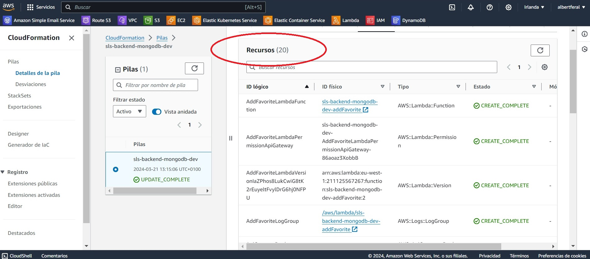
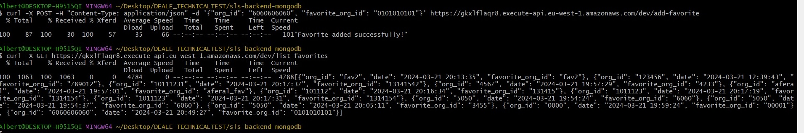
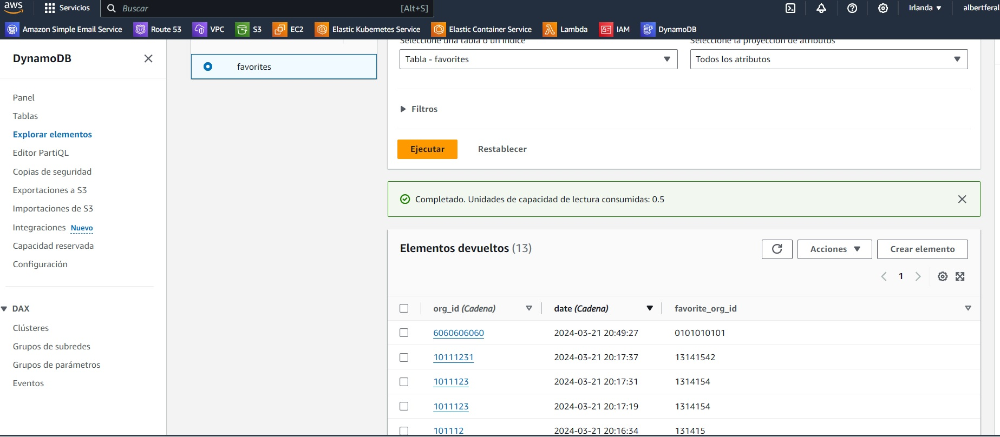
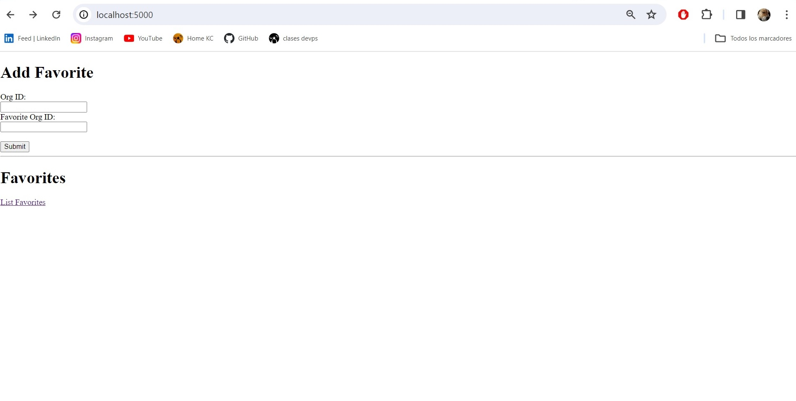

# BACKEND - SLS FRAMEWORK - AWS LAMBDA CON DYNAMODB

## ÍNDICE
- [Proyecto](#proyecto)
- [Funcionalidad](#funcionalidad)
- [Recursos](#recursos-desplegados)
- [Endpoints](#interactuando-con-los-endpoints-disponibles)
- [Añadir empresas con solicitud POST](#ejemplo-de-solicitud-post-para-añadir-las-empresas-favoritas)
- [Verificar lista con solicitud GET](#ejemplo-de-solicitud-get-para-listar-las-empresas-favoritas)
- [Frontend - pequeña interfaz web](#frontend)
- [Documentación](#documentación)

## Proyecto
Este proyecto contiene el código necesario para desplegar una aplicación backend utilizando Serverless Framework en AWS, el cual levantará todos los recursos necesarios como IaaS. 
La aplicación consiste en una API que se comunica con una base de datos DynamoDB para permitir a los usuarios guardar y listar sus empresas favoritas.
 - Todo el contenido del archivo [handler.py](handler.py) es parte del backend de la aplicación. Contiene funciones de AWS Lambda que se encargan de manejar las solicitudes HTTP entrantes y de interactuar con la base de datos DynamoDB para realizar operaciones como añadir una empresa a la lista de favoritos y listar todas las empresas favoritas almacenadas.
 - Por otra parte, el archivo [serverless.yml](serverless.yml) se encarga de definir la infraestructura necesaria en AWS y las rutas de las funciones Lambda.


### Funcionalidad
Para interactuar con nuestra API, contamos con dos endpoints que se han configurado en el archivo [serverless.yml](serverless.yml). Para desplegar el servicio, ejecutamos el siguiente comando:


```
sls-deploy
```


#### NOTA: Antes de realizar el despliegue, asegúrate de tener las credenciales de AWS configuradas en tu CLI. De lo contrario, es posible que encuentres errores de autenticación o permisos insuficientes.


### Recursos desplegados
Los más importantes para este proyecto son estos 3:

- Una función Lambda para manejar las solicitudes de la API.
- Un API Gateway que proporciona un punto de entrada para las solicitudes HTTP.
- Una tabla DynamoDB para almacenar las empresas favoritas de los usuarios.

Podemos ver todos los recursos del stack de Serverless Framework mediante el siguiente comando en nuestra terminal:

```
sls info --verbose
```

Si quisieramos obtener más detalles, podemos acceder a la consola AWS, en el apartado "Cloud Formation", donde se muestran todos y cada uno de los recursos generados en el deploy.





### Interactuando con los Endpoints disponibles
Si todo funciona correctamente, podremos observar tanto en la consola de AWS, como en nuestra terminal, que se han generado los recursos comentados anteriormente.

1. Endpoint /add-favorite permite a los usuarios añadir una empresa a su lista de favoritos. Los datos se envían en formato JSON y se almacenan en la tabla DynamoDB.
2. Endpoint /list-favorites devuelve la lista de empresas favoritas almacenadas en la base de datos. Los resultados se devuelven en formato JSON.

    

- URL base de la API: https://gkxlflaqr8.execute-api.eu-west-1.amazonaws.com/dev


- **POST /add-favorite**: Añade una empresa a la lista de favoritos. Requiere los parámetros `org_id` y `favorite_org_id` en el cuerpo de la solicitud.
- **GET /list-favorites**: Lista todas las empresas favoritas almacenadas.

Para interactuar con la api podemos usar diferentes herramientas como Postman, cURL, etc... 
#### Ejemplo de solicitud POST para añadir las empresas favoritas:

```
curl -X POST
https://gkxlflaqr8.execute-api.eu-west-1.amazonaws.com/dev/add-favorite
-H 'Content-Type: application/json'
-d '{
"org_id": "6060606060",
"favorite_org_id": "1010101010"
}'
```

#### Ejemplo de solicitud GET para listar las empresas favoritas:

```
curl -X GET
https://gkxlflaqr8.execute-api.eu-west-1.amazonaws.com/dev/list-favorites
```



Para verificar el correcto funcionamiento, accedemos a la consola de AWS en la seccion de DynamoDB y podremos observar la nueva información añadida en la tabla "favorites"




### FRONTEND
En este repositorio también hemos añadido un pequeño frontend para que la experiencia de DynamoDB sea un poco más visual.

- En [app.py](app.py) se define una aplicación Flask que maneja las solicitudes HTTP entrantes, interactúa con el backend a través de solicitudes HTTP utilizando la librería requests, y renderiza templates HTML utilizando Flask. Las funciones definidas en este archivo son las que manejan las interacciones del usuario con la aplicación, como añadir y listar empresas favoritas.
- En [templates](templates) definimos como se visualizará la web.

Para acceder ejecutamos el comando ```python app.py``` en el directorio donde se encuentra el archivo [app.py](app.py) y accedemos a http://localhost/5000



### Documentación
- AWS: https://docs.aws.amazon.com/es_es/
- Serverless Framework: https://www.serverless.com/framework/docs
- Python: https://docs.python.org/3/
- Flask: https://flask.palletsprojects.com/en/3.0.x/

---

<p align="right"><sub>Autor: Albert Fernández Alcázar</sub></p>
